# Module Architecture Plan

This note captures the semantic structure implemented for the top-level
`ankiops` package. The old code was raw material: names, module seams, and
public interfaces were all allowed to change.

Scope: top-level `ankiops/*.py`, plus the imports that `llm/` and `shared/` will
need to update. The existing `llm/` and `shared/` folders remain feature areas.

## North Star

AnkiOps is a collection synchronizer.

A collection contains Markdown deck files, note type definitions, media files,
deck sources, sync state, optional shared sources, and optional LLM tasks. The
core promise is to keep Markdown and Anki equivalent while preserving stable
note identity.

The module structure should make that story obvious:

- Root modules name product concepts: `collection`, `deck_sources`, `notes`,
  `note_types`, `markdown`, `media`, `interchange`.
- `sync/` owns synchronization artifacts: `report`, `state`, `identity`, and
  the directional note sync flows.
- External systems are named concretely: `anki`, `anki_rpc`, `git`.
- There is exactly one obvious home for each concept. No duplicate `media.py`
  and `sync/media.py`; no `media_state.py`; no separate note-type file/sync/API
  modules unless a real interface emerges.

Line count is only a smell check after the semantic cut. The first question is
always: "Where would a maintainer naturally look for this rule?"

## Implemented Shape

```text
ankiops/
  __init__.py
  cli.py
  cli_commands.py
  console.py

  collection.py
  deck_sources.py
  notes.py
  note_types.py
  markdown.py
  media.py
  interchange.py
  image_widths.py
  note_types_command.py

  markdown_to_html.py
  html_to_markdown.py
  math_delimiters.py

  anki.py
  anki_rpc.py
  git.py
  default_note_types/

  sync/
    __init__.py
    report.py
    state.py
    state_schema.py
    identity.py
    to_anki.py
    to_anki_deck.py
    from_anki.py

  llm/
  shared/
```

Possible later extractions:

- `sync/to_anki_plan.py` and `sync/to_anki_apply.py` only if the per-deck
  Markdown to Anki engine grows a real planning interface.
- `sync/from_anki_resolve.py` only if Anki note resolution becomes a reusable
  interface with focused tests.
- `interchange_validation.py` only if interchange validation becomes reusable
  outside `interchange.py`.

Do not create these files just to reduce size.

## Old To New Graph

```mermaid
flowchart LR
  initpy["__init__.py"] --> new_init["__init__.py"]

  cli["cli.py"] --> new_cli["cli.py"]
  cli --> commands["cli_commands.py"]
  cli_anki["cli_anki.py"] --> console["console.py"]
  log["log.py"] --> console

  config["config.py"] --> collection["collection.py"]
  init["init.py"] --> collection
  sources["sources.py"] --> deck_sources["deck_sources.py"]

  models["models.py"] --> notes["notes.py"]
  models --> note_types["note_types.py"]
  models --> report["sync/report.py"]
  tags["tags.py"] --> notes
  fingerprints["fingerprints.py"] --> notes

  markdown_format["markdown_format.py"] --> markdown["markdown.py"]
  fs["fs.py"] --> markdown
  fs --> note_types
  fs --> media["media.py"]
  fs --> md_html["markdown_to_html.py"]
  fs --> html_md["html_to_markdown.py"]

  markdown_converter["markdown_converter.py"] --> md_html
  html_converter["html_converter.py"] --> html_md
  math_delimiters["math_delimiters.py"] --> math["math_delimiters.py"]

  anki["anki.py"] --> new_anki["anki.py"]
  anki_client["anki_client.py"] --> anki_rpc["anki_rpc.py"]

  db["db.py"] --> sync_state["sync/state.py"]
  db_schema["db_schema.py"] --> sync_schema["sync/state_schema.py"]
  git["git.py"] --> new_git["git.py"]

  import_notes["import_notes.py"] --> to_anki["sync/to_anki.py"]
  import_notes --> to_anki_deck["sync/to_anki_deck.py"]
  export_notes["export_notes.py"] --> from_anki["sync/from_anki.py"]
  note_identity["note_identity.py"] --> identity["sync/identity.py"]

  sync_media["sync_media.py"] --> media
  sync_note_types["sync_note_types.py"] --> note_types

  serializer["serializer.py"] --> interchange["interchange.py"]
  image_widths["image_widths.py"] --> image_widths_new["image_widths.py"]
  note_type_cli["note_type_cli.py"] --> note_types_command["note_types_command.py"]
  bundled_note_types["note_types/* bundled assets"] --> default_note_types["default_note_types/*"]
```



## Module Charters

### `cli.py`

Owns argument parsing and command dispatch. It should not contain workflow
logic.

### `cli_commands.py`

Owns top-level command workflows:

- `init`
- Markdown to Anki sync
- Anki to Markdown sync
- interchange import/export
- image width normalization
- LLM command delegation
- shared-source command delegation
- note-type command delegation

The specialized `note-types` terminal interaction remains in
`note_types_command.py`; `cli_commands.py` is the command surface that `cli.py`
routes to.

### `console.py`

Owns terminal-adjacent helpers:

- logging configuration
- clickable path rendering
- connect-or-exit behavior for Anki

### `collection.py`

Owns the AnkiOps collection as a local workspace:

- well-known names: `.ankiops.db`, `note_types/`, `media/`, `llm/`
- deck name to filename mapping
- active collection resolution
- active Anki profile guard
- collection initialization
- tutorial creation

This module answers: "Where is the collection, and what files define its local
shape?"

### `deck_sources.py`

Owns the roots that contribute deck files to one logical collection:

- local source
- shared source roots
- source display names and GitHub slugs
- scoped note type names for shared sources
- Markdown deck file discovery per source
- note type loading per source

This deserves its own module because a deck source is a domain concept, not just
a helper hidden inside `collection.py`. It is the bridge between the core
collection and the `shared/` feature area.

Suggested renames:

- `SyncSource` -> `DeckSource`
- `SourceConfigs` -> `SourceNoteTypes`
- `discover_sync_sources` -> `discover_deck_sources`
- `markdown_files_for_source` -> `deck_files_for_source`

### `notes.py`

Owns note-shaped data and note-local rules:

- `Note`
- `AnkiNote`
- tag normalization and formatting
- stable note fingerprints
- note validation that depends only on a note and its note type

This module does not own cross-system identity resolution. That belongs in
`sync/identity.py`, because it needs Anki lookup and sync state.

Suggested renames:

- Keep `Note`
- Keep `AnkiNote`
- Move `MarkdownFile` out; rename it in `markdown.py` as `DeckFile`

### `note_types.py`

Owns note type definitions and lifecycle:

- `NoteField` (current `Field`)
- `NoteType` (current `NoteTypeConfig`)
- `ANKIOPS_KEY_FIELD`
- identifying-label invariants
- choice/cloze note type rules
- `note_type.yaml` loading
- template/CSS loading and built-in note type ejection
- syncing local note type definitions into Anki

This is one concept from definition files to Anki sync. Splitting it into
`note_type_files.py`, `sync/note_types.py`, and `anki_note_types.py` makes callers
learn implementation stages instead of the product concept.

Anki's RPC calls use "model" terminology. That vocabulary should be confined to
`anki.py`/`anki_rpc.py`; the rest of AnkiOps should say "note type".

Built-in packaged note type assets live in `default_note_types/`, so the product
module `note_types.py` no longer collides with a resource package of the same
name.

### `markdown.py`

Owns the AnkiOps Markdown deck format:

- note separator
- managed metadata comments: `note_key`, `note_type`, tags
- field-label parsing
- deck file parsing
- deck file rendering
- metadata formatting primitives used by `sync/to_anki_deck.py`

This module should expose the format as a deep interface. Callers should not
need to know how comments, code fences, field labels, and inferred note types
interact.

Suggested rename:

- `MarkdownFile` -> `DeckFile`

### `media.py`

Owns media as one product concept:

- media reference extraction from Markdown and Anki HTML
- media path normalization
- media hashing and local rename policy
- Markdown reference rewriting after hashing
- local orphan cleanup
- pushing referenced media to Anki
- pulling referenced media from Anki
- media status formatting

There should be only one `media.py`. Persistent media fingerprints and reference
caches live behind `sync/state.py`; they are implementation details of sync
state, not a separate public media module.

### `interchange.py`

Owns the portable JSON-compatible interchange format:

- serialize all decks or a selected deck tree
- deserialize all decks or a selected deck tree
- validate duplicate deck names and duplicate note keys
- plan target Markdown deck files before writing
- write validated deck files

"Interchange" is deliberately broader than "collection JSON": the format can
represent a whole collection or a scoped deck tree.

### `markdown_to_html.py`, `html_to_markdown.py`, `math_delimiters.py`

Own conversion rules:

- Markdown to Anki HTML
- Anki HTML to Markdown
- math delimiter preservation and normalization

Directional names are clearer than a generic `conversion.py`, because sync
callers care about direction.

### `anki.py`

Owns the high-level Anki interface:

- active profile
- deck lookup and creation
- note lookup
- note create/update/delete/move
- note type create/update
- note type conversion
- media file copy in/out of Anki's media directory

Keep this as one concrete Anki module. It is the external-system seam. The raw
HTTP/RPC details live in `anki_rpc.py`.

Suggested renames:

- `AnkiAdapter` -> `Anki`
- `fetch_model_names` -> `fetch_note_type_names`
- `fetch_model_states` -> `fetch_note_type_states`
- `create_models` -> `create_note_types`
- `update_models` -> `update_note_types`

### `anki_rpc.py`

Owns raw AnkiOpsConnect/AnkiConnect transport:

- endpoint selection
- fallback policy
- action invocation
- transport-level errors

No domain vocabulary should leak into this module beyond request payloads.

### `git.py`

Owns Git operations for a collection:

- pre-operation snapshots
- subtree operations used by `shared/`
- GitHub-facing shared source support where it already exists

This module is already concrete and cohesive.

### `image_widths.py`

Owns the image width normalization tool. It is a narrow tool, not part of the
core sync structure.

### `note_types_command.py`

Owns terminal behavior for the `note-types` command:

- interactive prompts
- tables
- copying note types from Anki into local definition files

Keep CLI interaction out of `note_types.py` so the concept module remains usable
from sync code and tests without terminal behavior.

## Sync Package Charters

### `sync/report.py`

Owns the result vocabulary for sync operations:

- `ChangeType`
- `Change`
- `SyncReport` (old `SyncResult`)
- `CollectionReport` (old `CollectionResult`)
- `SyncSummary`
- `UntrackedDeck`
- `ProtectedNoteGroup`

This is not generic domain data. It is what a sync operation did.

### `sync/state.py`

Owns persistent sync state:

- note key to Anki note id mappings
- deck name to Anki deck id mappings
- import/export fingerprints
- media reference cache
- media fingerprints and pushed digests
- active profile name
- note type sync fingerprint
- note key generation

The class should be named `SyncState`, not `SQLiteDbAdapter`. SQLite is the
implementation. The interface is "what sync remembers between runs."

There is no `media_state.py`; media persistence is one part of sync state.

### `sync/state_schema.py`

Owns the SQLite schema for `sync/state.py`.

This is implementation detail, but keeping the schema in its own module is fine
because it is declarative and imported only by `sync/state.py`.

### `sync/identity.py`

Owns stable note identity across Markdown, Anki, and sync state:

- embedded `AnkiOps Key` handling
- sync-state note mapping lookup
- Anki field lookup fallback
- duplicate key detection
- export uniqueness assertions

This module answers: "Which Markdown note and Anki note are the same managed
note?"

### `sync/to_anki.py`

Owns collection-level Markdown-canonical sync coordination:

- discover deck sources
- read Markdown deck files
- validate deck ownership
- resolve global note identity
- coordinate per-deck sync
- update collection-level sync state
- produce sync reports

### `sync/to_anki_deck.py`

Owns per-deck Markdown-canonical sync:

- resolve the target Anki deck
- decide which notes create/update/delete/move/convert
- apply deck-local changes to Anki
- write managed metadata back to Markdown
- update note/deck membership state
- refresh deck membership after moves/deletes

This is the dense part of import sync, but it is one semantic engine. If it
grows unwieldy, extract by real interface:

- `to_anki_plan.py`: a real plan object that can be tested without mutation
- `to_anki_apply.py`: applying that plan to Anki, Markdown, and sync state

Do not extract those files until the plan/apply interfaces exist as concepts in
the code, not just as line-count pressure.

### `sync/from_anki.py`

Owns Anki-canonical note sync:

- discover deck sources
- fetch Anki notes and deck/card membership
- resolve note keys
- convert Anki notes to Markdown notes
- preserve deck ordering
- write Markdown deck files
- update sync state
- produce sync reports

If Anki note resolution becomes independently testable and reusable, extract
`from_anki_resolve.py`. Otherwise keep the flow together.

## Deleted Public Concepts

These old public modules/interfaces disappeared, because their names
describe implementation packaging rather than AnkiOps concepts.

- `models.py`: too ambiguous; conflicts with LLM models and Anki models.
- `fs.py` / `FileSystemAdapter`: not a real adapter seam; it mixes Markdown,
  note type files, media, and conversion.
- `db.py` / `SQLiteDbAdapter`: callers need sync state, not SQLite.
- `serializer.py`: implementation-shaped; the concept is interchange.
- `sync_media.py`: media has one home, `media.py`.
- `sync_note_types.py`: note types have one home, `note_types.py`.

## Implemented Size

Line count is not the design driver, but it is a useful readability check after
the semantic cut. These counts are from the implemented tree after formatting.

| Module | LOC | Revisit at | Why this size is acceptable |
| --- | ---: | ---: | --- |
| `anki.py` | 539 | 750 | One concrete external-system interface over Anki. |
| `anki_rpc.py` | 123 | 220 | Raw request transport only. |
| `cli.py` | 364 | 450 | Parser construction and command dispatch. |
| `cli_commands.py` | 456 | 650 | Command handlers are workflow glue; split only by command family. |
| `collection.py` | 262 | 500 | Paths, deck filename mapping, profile guard, initialization. |
| `console.py` | 137 | 300 | Logging, clickable paths, and connect-or-exit terminal helper. |
| `deck_sources.py` | 134 | 260 | Local/shared source discovery and scoped note type loading. |
| `git.py` | 243 | 400 | Concrete collection Git operations. |
| `html_to_markdown.py` | 430 | 550 | Directional conversion from Anki HTML to Markdown. |
| `image_widths.py` | 194 | 300 | Focused standalone tool. |
| `interchange.py` | 631 | 850 | One portable format for collections and selected deck trees. |
| `markdown.py` | 424 | 650 | One deep interface for the AnkiOps Markdown deck format. |
| `markdown_to_html.py` | 147 | 280 | Directional conversion from Markdown to Anki HTML. |
| `math_delimiters.py` | 87 | 160 | Focused conversion helper. |
| `media.py` | 588 | 850 | One concept: references, hashing, rewriting, push/pull sync. |
| `note_types.py` | 528 | 800 | Definitions, YAML/templates, invariants, and Anki sync. |
| `note_types_command.py` | 412 | 600 | CLI interaction for one command. |
| `notes.py` | 178 | 350 | Note data, tags, note-local fingerprints. |
| `sync/from_anki.py` | 734 | 950 | Anki-canonical sync and note resolution. |
| `sync/identity.py` | 252 | 400 | Stable note identity resolution. |
| `sync/report.py` | 321 | 450 | Sync result vocabulary and summary logic. |
| `sync/state.py` | 706 | 900 | One deep interface for persistent sync memory. |
| `sync/state_schema.py` | 57 | 140 | Declarative schema only. |
| `sync/to_anki.py` | 264 | 450 | Collection-level import coordinator. |
| `sync/to_anki_deck.py` | 855 | 1000 | Per-deck import engine; split only around real plan/apply interfaces. |

The highest-risk modules are `sync/to_anki_deck.py`, `media.py`, and
`interchange.py`. If they cross the revisit threshold, split by semantic
interface, not by helper category:

- `sync/to_anki_plan.py` only if planning is testable without Anki/Markdown
  mutation.
- `sync/to_anki_apply.py` only if applying a plan has a clear interface.
- `interchange_validation.py` only if validation is reused independently.
- Do not split `media.py` into sync/storage/parser fragments; that recreates the
  duplicate-concept problem.

## Refactor Order

1. Create `sync/report.py`.
   - Move report vocabulary out of `models.py`.
   - Rename old `SyncResult` to `SyncReport`.
   - Rename old `CollectionResult` to `CollectionReport`.

2. Create core concept modules.
   - `notes.py`
   - `note_types.py`
   - `markdown.py`
   - `deck_sources.py`

3. Rename external-system modules.
   - `anki_client.py` -> `anki_rpc.py`
   - `db.py` -> `sync/state.py`
   - `db_schema.py` -> `sync/state_schema.py`

4. Delete `FileSystemAdapter` as a public interface.
   - Move Markdown parsing/rendering to `markdown.py`.
   - Move note type file loading/ejection to `note_types.py`.
   - Move media reference rewriting to `media.py`.
   - Use conversion modules directly.

5. Move note sync directions.
   - `note_identity.py` -> `sync/identity.py`
   - `import_notes.py` -> `sync/to_anki.py` and `sync/to_anki_deck.py`
   - `export_notes.py` -> `sync/from_anki.py`

6. Consolidate concept workflows.
   - `sync_media.py` -> `media.py`
   - `sync_note_types.py` -> `note_types.py`
   - `serializer.py` -> `interchange.py`

7. Finish command-facing names.
   - `cli.py` parser/entrypoint
   - `cli_commands.py` command handlers
   - `log.py`, `cli_anki.py` -> `console.py`
   - `note_type_cli.py` -> `note_types_command.py`

## Smell Checks

Use these after the semantic move, not before it:

- If callers import private helpers from a module, the interface is leaking.
- If a module has two unrelated reasons to change, split by concept.
- If two modules share the same noun, one of them is probably misplaced.
- If a module name describes storage, protocol, or file shape before product
  meaning, try renaming it from the caller's point of view.
- If a proposed split creates two shallow pass-through modules, keep one deeper
  module.

## Verification Strategy

After each phase:

- Run focused unit tests for the moved concept.
- Run sync integration tests after `sync/` moves.
- Run media integration tests after `media.py`.
- Run serialization/interchange tests after `interchange.py`.
- Run CLI integration tests after command rewiring.
- Run full tests after broad import rewrites.
